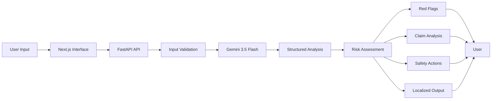
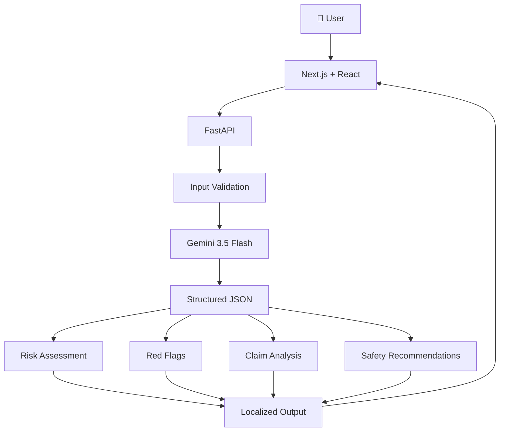

<div align="center">

# 🛡️ NIVESHRAKSHAK

<a href="https://github.com/ankush-dev-eng/NiveshRakshak">
  
</a>


</div>

---

## ◉ The Problem

Financial scams rarely arrive looking like scams.

They arrive as:

- WhatsApp investment opportunities
- "Guaranteed return" promises
- Fake regulatory or institutional claims
- Trading groups and private signal communities
- Urgent KYC or account-blocking messages
- OTP / credential requests
- Social-media investment pitches
- High-pressure payment requests

For a first-time or retail investor, the difficult question isn't only:

> **"Is this a scam?"**

It is:

> **"What exactly should make me suspicious?"**

NiveshRakshak focuses on that gap.

---

# ◉ The Solution

## **NIVESHRAKSHAK**

NiveshRakshak analyzes user-supplied financial content with **Google Gemini 3.5 Flash** and converts it into a structured, evidence-oriented risk assessment.

Instead of simply returning:

> ❌ SCAM

the system explains:

> **WHAT WAS OBSERVED**
> **WHY IT MAY MATTER**
> **WHAT SHOULD BE VERIFIED**
> **WHAT THE USER CAN DO NEXT**

The system is intentionally designed as an **AI-assisted risk analysis tool**, not as a replacement for official verification or professional financial advice.

---

## ✦ Core Features

<table>
<tr>
<td width="50%" valign="top">

---

# ◉ Product Flow



---

# ◉ What the AI Produces

A live analysis can contain:

```text
RISK LEVEL
↓
RISK SCORE
↓
AI SUMMARY
↓
RED FLAGS
↓
CLAIMS
↓
EVIDENCE
↓
RECOMMENDED ACTIONS
↓
VERIFICATION STEPS
↓
SAFETY DISCLAIMER
```

### Example

**Input**

```text
URGENT: Get ₹20,000 from ₹5,000 in 48 hours.
Send the payment to this personal UPI ID.
Only two slots remain.
```

**Possible analysis**

```text
CRITICAL RISK

Red flags:
01 — Unrealistic guaranteed return
02 — Extremely short timeframe
03 — Payment to a personal UPI ID
04 — Artificial scarcity / urgency

Evidence:
"₹20,000 from ₹5,000 in 48 hours"
"Send the payment to this personal UPI ID"
"Only two slots remain"
```

The important distinction is that the system should explain **observable characteristics of the supplied content** rather than inventing unrelated financial claims.

---

# ◉ Live AI vs Demo Mode

NiveshRakshak deliberately separates the two.

| Mode                       | Purpose                        | Source                   |
| -------------------------- | ------------------------------ | ------------------------ |
| 🟢`LIVE GEMINI ANALYSIS` | Arbitrary user input           | Gemini 3.5 Flash         |
| 🟠`DEMO MODE`            | Predefined synthetic scenarios | Deterministic local data |

The API returns an explicit:

```json
{
  "analysis_source": "gemini"
}
```

or:

```json
{
  "analysis_source": "demo"
}
```

This prevents a polished demo response from being mistaken for a live model response.

---

# ◉ Safety & Guardrails

NiveshRakshak is designed around a few strict principles:

### 01 — No Personalized Investment Advice

The system does not tell users which stocks, mutual funds, crypto assets, brokers, or financial products to buy.

### 02 — No Automatic Proof of Fraud

An AI risk assessment is **not proof that a person, company, message, or investment is fraudulent**.

### 03 — Evidence Before Conclusions

The analysis should be grounded in the content supplied by the user.

### 04 — Uncertainty Is Explicit

When information is insufficient, the system can return:

> **Insufficient context for financial risk analysis.**

rather than inventing context.

### 05 — Human Verification Still Matters

Users are encouraged to independently verify important claims using appropriate official sources.

---

# ◉ Architecture



---

# ◉ Tech Stack

<div align="center">


</div>

---

# ◉ Getting Started

## Prerequisites

Make sure you have:

- Node.js
- npm
- Python 3.x
- a Gemini API key

---

## 1. Clone

```bash
git clone YOUR_REPOSITORY_URL
cd NiveshRakshak
```

---

## 2. Backend Setup

```bash
cd backend

python -m venv venv
```

### Windows

```powershell
.\venv\Scripts\activate
```

### Install dependencies

```bash
pip install -r requirements.txt
```

Create:

```text
backend/.env
```

Add:

```env
GEMINI_API_KEY=YOUR_GEMINI_API_KEY
```

> ⚠️ Never commit `.env` or expose the API key to the frontend.

---

## 3. Start the API

```bash
uvicorn main:app --reload --port 8080
```

Backend:

```text
http://localhost:8080
```

Health check:

```text
http://localhost:8080/api/health
```

---

## 4. Frontend Setup

Open a second terminal:

```bash
cd frontend
npm install
npm run dev -- --port 3000
```

Frontend:

```text
http://localhost:3000
```

---

# ◉ Test the API

### Health

```bash
GET /api/health
```

### Live analysis

```bash
POST /api/analyze
```

Example:

```json
{
  "content": "URGENT: Invest ₹5000 today and receive ₹20000 in 48 hours. Only two slots remain.",
  "language": "English",
  "mode": "live"
}
```

Expected source:

```json
{
  "analysis_source": "gemini"
}
```

For the deterministic demo engine:

```json
{
  "mode": "demo"
}
```

Expected:

```json
{
  "analysis_source": "demo"
}
```

---

# ◉ Testing

Run backend tests:

```bash
cd backend
.\venv\Scripts\python -m pytest
```

Run the production frontend build:

```bash
cd frontend
npm run build
```

The project includes tests for important behavior including:

- health endpoint
- invalid/empty input
- oversized input
- explicit demo mode
- live analysis path
- analysis source
- AI-grounded analysis behavior

---

# ◉ Demo Scenarios

The Demo Center contains synthetic scenarios designed for a reliable presentation:

```text
01 — GUARANTEED RETURN SCAM

02 — FAKE REGULATORY APPROVAL

03 — CREDENTIAL / OTP PHISHING

04 — FAKE TRADING MENTOR

05 — EDUCATIONAL FINANCIAL MESSAGE
```

Each can be:

**LOAD → ANALYZE → INSPECT**

without depending on a live Gemini response.

---

# ◉ Interface

The visual system deliberately follows the product's cinematic security aesthetic.

```text
BACKGROUND     #08080A
FOREGROUND     #F3F1EA
MUTED          #807F78
SURFACE        #111114
SURFACE 2      #17171B
SIGNATURE RED  #FF3B1D
ACCENT 2       #FF6A3D
```

Typography:

```text
ANTON  →  Display / risk levels / major headings
ONEST  →  Interface / body / analysis content
```

Design principles:

- high contrast
- editorial typography
- thin dividers
- restrained color
- cinematic spacing
- motion used for hierarchy
- red reserved for important risk/action states

---

# ◉ Motion & Interaction

NiveshRakshak treats motion as information architecture rather than decoration. Animations establish sequence, communicate state, guide attention, and make the analysis easier to follow.

The application combines:

- Framer Motion
- CSS transitions
- viewport-triggered reveals
- staggered entrance animations
- state-aware transitions

### ◌ Motion Hierarchy

```text
PAGE ENTRY
↓
PRELOADER
↓
HERO REVEAL
↓
SCROLL REVEALS
↓
USER INTERACTION
↓
LIVE ANALYSIS
↓
RISK STATE
↓
RED FLAGS
↓
CLAIMS
↓
ACTION PLAN
↓
VERIFICATION
↓
FINAL DISCLAIMER
```

### ◌ Cinematic Preloader

The landing page begins with a short cinematic introduction:

```text
NIVESHRAKSHAK

0% ─────────────── 100%
```

---

# ◉ Project Structure

```text
NiveshRakshak/
│
├── backend/
│   ├── main.py
│   ├── requirements.txt
│   ├── test_main.py
│   ├── test_gemini.py
│   ├── .env.example
│   └── venv/
│
├── frontend/
│   ├── src/
│   │   ├── app/
│   │   │   ├── dashboard/
│   │   │   ├── demo/
│   │   │   ├── trust/
│   │   │   ├── architecture/
│   │   │   └── page.tsx
│   │   │
│   │   ├── components/
│   │   │   ├── layout/
│   │   │   └── ui/
│   │   │
│   │   └── lib/
│   │
│   ├── public/
│   ├── package.json
│   └── next.config.*
│
├── README.md
└── .gitignore
```

---

# ◉ Application Routes

| Route             | Purpose                               |
| ----------------- | ------------------------------------- |
| `/`             | Product landing page                  |
| `/dashboard`    | Live AI analysis workspace            |
| `/demo`         | Deterministic demonstration scenarios |
| `/trust`        | Safety, limitations & guardrails      |
| `/architecture` | Technical architecture                |

---

# ◉ Why NiveshRakshak?

Most fraud interfaces stop at:

> **"This looks suspicious."**

NiveshRakshak is designed to go one step further:

> **"Here is what was observed, here is why it matters, and here is what you should verify before acting."**

That distinction makes the system useful not only for detecting suspicious language, but also for helping users understand **why they should slow down**.

---

# ◉ Limitations

NiveshRakshak is an AI-assisted analysis tool.

It cannot:

- prove that a message is fraudulent
- independently verify every claim
- replace regulators or law enforcement
- guarantee the legitimacy of an investment
- provide personalized financial advice
- predict investment returns

AI output should be treated as informational guidance and independently verified where appropriate.

---

# ◉ Future Scope

Potential future extensions include:

- 📷 Screenshot / image analysis
- 🎙️ Voice-message analysis
- 🌐 More Indian regional languages
- 🔎 Official-source verification workflows
- 📱 Mobile-first PWA
- 🧠 Retrieval-assisted regulatory knowledge
- 📨 Browser / email / messaging integrations
- 📈 Explainable risk trends
- 🛡️ Enterprise fraud-awareness workflows

---

# ◉ Demo

### Local

```text
Frontend → http://localhost:3000
Backend  → http://localhost:8080
```

### Live Demo

> Replace this with the deployed URL once the project is hosted.

```text
https://YOUR-LIVE-DEMO-URL
```

### Demo Video

> Replace with the final YouTube/video URL.

```text
https://youtu.be/YOUR_VIDEO_ID
```

---

# ◉ Hackathon Highlights

### Built Around Real User Behavior

Designed around the types of messages users actually encounter:

```text
WhatsApp
SMS
Telegram
Email
Social Media
Investment Offers
Phishing Messages
```

### AI + Explainability

The output is structured into:

```text
Risk
↓
Evidence
↓
Explanation
↓
Action
↓
Verification
```

### Bharat-First Accessibility

Supports:

```text
English
Hindi
Marathi
Hinglish
```

with localized analysis rather than simply translating navigation labels.

---

# ◉ Security Notes

Never commit:

```text
backend/.env
```

Never expose:

```text
GEMINI_API_KEY
```

The Gemini credential is intended to remain server-side.

Recommended Git check before pushing:

```bash
git status
```

Make sure `.env` is ignored.

---

# ◉ Contributing

Contributions and improvements are welcome.

```bash
git checkout -b feature/your-feature
git add .
git commit -m "Add your feature"
git push origin feature/your-feature
```

Then open a pull request.

---

# ◉ License

Add the project's chosen license here.

Example:

```text
MIT License
```

See [`LICENSE`](LICENSE) for details.

---

<div align="center">
