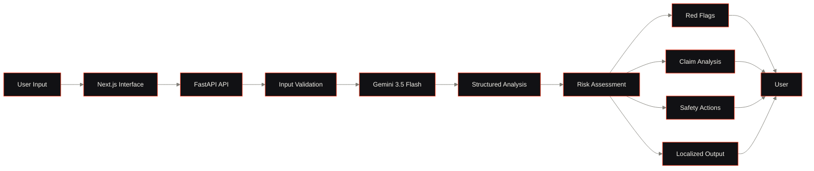
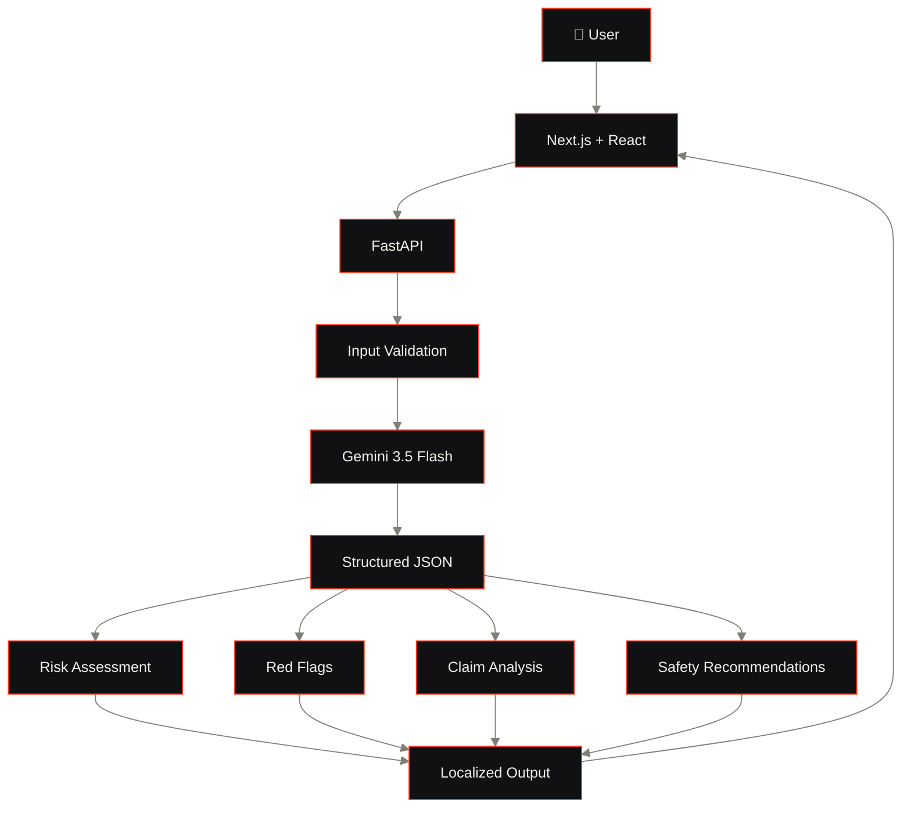

<div align="center">


<br/>

<a href="https://github.com/ankush-dev-eng/NiveshRakshak">
  
</a>

<br/><br/>


<br/>


</div>

<br/>

<div align="center">

### ANALYZE BEFORE YOU ACT.

An AI-assisted financial safety platform that analyzes suspicious investment messages, detects red flags, evaluates claims, and produces structured risk assessments — powered by **Google Gemini 3.5 Flash**.

</div>

---

# ◉ THE PROBLEM

Financial scams rarely arrive looking like scams.

They arrive as:

- WhatsApp investment opportunities
- "Guaranteed return" promises
- Fake regulatory or institutional claims
- Trading groups and private signal communities
- Urgent KYC or account-blocking messages
- OTP / credential requests
- Social-media investment pitches
- High-pressure payment requests

For a first-time or retail investor, the difficult question isn't only:

> **"Is this a scam?"**

It is:

> **"What exactly should make me suspicious?"**

NiveshRakshak focuses on that gap.

---

# ◉ THE SOLUTION

NiveshRakshak analyzes user-supplied financial content with **Google Gemini 3.5 Flash** and converts it into a structured, evidence-oriented risk assessment.

Instead of simply returning:

> ❌ SCAM

the system explains:

> **WHAT WAS OBSERVED**
> **WHY IT MAY MATTER**
> **WHAT SHOULD BE VERIFIED**
> **WHAT THE USER CAN DO NEXT**

The system is intentionally designed as an **AI-assisted risk analysis tool**, not as a replacement for official verification or professional financial advice.

---

# ◉ CORE FEATURES

```text
01 — LIVE AI ANALYSIS        Gemini 3.5 Flash on arbitrary user input
02 — RED FLAG DETECTION       Pattern-based evidence extraction
03 — CLAIM ASSESSMENT         Individual claim verification status
04 — RISK SCORING             LOW / MEDIUM / HIGH / CRITICAL
05 — MULTILINGUAL OUTPUT      English · Hindi · Marathi · Hinglish
06 — DEMO CENTER              5 deterministic scenarios for presentation
07 — SAFETY GUARDRAILS        No investment advice · no fraud proof
08 — SOURCE TRANSPARENCY      Every response tagged gemini or demo
```

---

# ◉ PRODUCT FLOW



---

# ◉ WHAT THE AI PRODUCES

A live analysis contains:

```text
01 — RISK LEVEL
     ↓
02 — RISK SCORE
     ↓
03 — AI SUMMARY
     ↓
04 — RED FLAGS
     ↓
05 — CLAIMS
     ↓
06 — EVIDENCE
     ↓
07 — RECOMMENDED ACTIONS
     ↓
08 — VERIFICATION STEPS
     ↓
09 — SAFETY DISCLAIMER
```

### Example

**Input**

```text
URGENT: Get ₹20,000 from ₹5,000 in 48 hours.
Send the payment to this personal UPI ID.
Only two slots remain.
```

**Possible analysis**

```text
CRITICAL RISK

Red flags:
01 — Unrealistic guaranteed return
02 — Extremely short timeframe
03 — Payment to a personal UPI ID
04 — Artificial scarcity / urgency

Evidence:
"₹20,000 from ₹5,000 in 48 hours"
"Send the payment to this personal UPI ID"
"Only two slots remain"
```

The important distinction is that the system should explain **observable characteristics of the supplied content** rather than inventing unrelated financial claims.

---

# ◉ LIVE AI vs DEMO MODE

NiveshRakshak deliberately separates the two.

| Mode | Purpose | Source |
| --- | --- | --- |
| 🟢 `LIVE GEMINI ANALYSIS` | Arbitrary user input | Gemini 3.5 Flash |
| 🟠 `DEMO MODE` | Predefined synthetic scenarios | Deterministic local data |

The API returns an explicit:

```json
{
  "analysis_source": "gemini"
}
```

or:

```json
{
  "analysis_source": "demo"
}
```

This prevents a polished demo response from being mistaken for a live model response.

---

# ◉ SAFETY & GUARDRAILS

NiveshRakshak is designed around a few strict principles:

```text
01 — NO PERSONALIZED INVESTMENT ADVICE
     The system does not tell users which stocks, mutual funds,
     crypto assets, brokers, or financial products to buy.

02 — NO AUTOMATIC PROOF OF FRAUD
     An AI risk assessment is not proof that a person, company,
     message, or investment is fraudulent.

03 — EVIDENCE BEFORE CONCLUSIONS
     The analysis should be grounded in the content
     supplied by the user.

04 — UNCERTAINTY IS EXPLICIT
     When information is insufficient, the system returns
     "Insufficient context" rather than inventing context.

05 — HUMAN VERIFICATION STILL MATTERS
     Users are encouraged to independently verify important
     claims using appropriate official sources.
```

---

# ◉ ARCHITECTURE



---

# ◉ TECH STACK

<div align="center">

| Layer | Technology |
| --- | --- |
| **Frontend** | Next.js · React · TypeScript · Tailwind CSS |
| **Animation** | Framer Motion · CSS Transitions |
| **Backend** | FastAPI · Python · Uvicorn |
| **AI Engine** | Google Gemini 3.5 Flash |
| **Typography** | Anton (display) · Onest (interface) |
| **Design** | Cinematic dark theme · editorial layout |

</div>

---

# ◉ GETTING STARTED

## Prerequisites

Make sure you have:

- Node.js
- npm
- Python 3.x
- a Gemini API key

---

## 1. Clone

```bash
git clone https://github.com/ankush-dev-eng/NiveshRakshak.git
cd NiveshRakshak
```

---

## 2. Backend Setup

```bash
cd backend

python -m venv venv
```

### Windows

```powershell
.\venv\Scripts\activate
```

### Install dependencies

```bash
pip install -r requirements.txt
```

Create:

```text
backend/.env
```

Add:

```env
GEMINI_API_KEY=YOUR_GEMINI_API_KEY
```

> ⚠️ Never commit `.env` or expose the API key to the frontend.

---

## 3. Start the API

```bash
uvicorn main:app --reload --port 8080
```

Backend:

```text
http://localhost:8080
```

Health check:

```text
http://localhost:8080/api/health
```

---

## 4. Frontend Setup

Open a second terminal:

```bash
cd frontend
npm install
npm run dev -- --port 3000
```

Frontend:

```text
http://localhost:3000
```

---

# ◉ TEST THE API

### Health

```bash
GET /api/health
```

### Live analysis

```bash
POST /api/analyze
```

Example:

```json
{
  "content": "URGENT: Invest ₹5000 today and receive ₹20000 in 48 hours. Only two slots remain.",
  "language": "English",
  "mode": "live"
}
```

Expected source:

```json
{
  "analysis_source": "gemini"
}
```

For the deterministic demo engine:

```json
{
  "mode": "demo"
}
```

Expected:

```json
{
  "analysis_source": "demo"
}
```

---

# ◉ TESTING

Run backend tests:

```bash
cd backend
.\venv\Scripts\python -m pytest
```

Run the production frontend build:

```bash
cd frontend
npm run build
```

The project includes tests for important behavior including:

- health endpoint
- invalid/empty input
- oversized input
- explicit demo mode
- live analysis path
- analysis source
- AI-grounded analysis behavior

---

# ◉ DEMO SCENARIOS

The Demo Center contains synthetic scenarios designed for a reliable presentation:

```text
01 — GUARANTEED RETURN SCAM
02 — FAKE REGULATORY APPROVAL
03 — CREDENTIAL / OTP PHISHING
04 — FAKE TRADING MENTOR
05 — EDUCATIONAL FINANCIAL MESSAGE
```

Each can be:

**LOAD → ANALYZE → INSPECT**

without depending on a live Gemini response.

---

# ◉ VISUAL IDENTITY

| Token | Hex | Role |
| --- | --- | --- |
|  | `#08080A` | Background |
|  | `#F3F1EA` | Foreground |
|  | `#807F78` | Muted |
|  | `#111114` | Surface |
|  | `#17171B` | Surface 2 |
|  | `#FF3B1D` | Signature Red |
|  | `#FF6A3D` | Accent 2 |

**Typography:** `ANTON` — display / risk levels / headings · `ONEST` — interface / body / analysis

**Design language:** Cinematic · Editorial · High Contrast · Restrained · Motion-Driven · Red reserved for risk states

---

# ◉ MOTION & INTERACTION

Motion is treated as information architecture rather than decoration. Animations establish sequence, communicate state, guide attention, and make the analysis easier to follow.

The application combines:

- **Framer Motion** — page transitions, entrance animations, exit animations
- **CSS transitions** — hover states, color changes, border reveals
- **CSS keyframes** — marquee ticker, loading pulse, ping indicators
- **Viewport-triggered reveals** — staggered content entrance on scroll
- **State-aware transitions** — AnimatePresence for loading/result/error states

### ◌ Motion Hierarchy

```text
PAGE ENTRY
  ↓
PRELOADER
  ↓
HERO REVEAL
  ↓
MARQUEE TICKER
  ↓
SCROLL SECTIONS
  ↓
USER INTERACTION
  ↓
LIVE ANALYSIS
  ↓
RISK STATE
  ↓
RED FLAGS
  ↓
CLAIMS
  ↓
ACTION PLAN
  ↓
VERIFICATION
  ↓
FINAL DISCLAIMER
```

### ◌ Cinematic Preloader

The landing page begins with a cinematic loading sequence. A full-screen overlay displays the **NIVESHRAKSHAK** wordmark while a progress counter advances from 0% to 100%. On completion, the preloader slides upward with a custom cubic-bezier ease, revealing the hero section beneath.

```text
NIVESHRAKSHAK

0% ─────────────── 100%
          ↓
     [ SLIDE UP ]
```

Respects `prefers-reduced-motion` via Framer Motion's `MotionConfig reducedMotion="user"`.

### ◌ Hero Reveal

After the preloader exits, hero elements animate in with staggered delays:

```text
DELAY    ELEMENT
1.0s     badge ("AI-Powered Financial Safety")
1.1s     headline
1.2s     description
1.3s     CTA buttons
2.0s     scroll indicator
```

Each element enters with `opacity: 0 → 1` and `y: 20–30px → 0`.

### ◌ Marquee Ticker

A continuous horizontal scroll of safety phrases runs on CSS `animate-marquee`:

```text
DETECT RED FLAGS · VERIFY BEFORE YOU TRUST · THINK BEFORE YOU TRANSFER · QUESTION GUARANTEED RETURNS · PROTECT YOUR MONEY
```

### ◌ Analysis State Transitions

The dashboard uses `AnimatePresence mode="wait"` to manage four exclusive states:

```text
EMPTY        →  dashed border · "Awaiting Input"
LOADING      →  pulsing accent glow · spinning loader · "Running Risk Engine"
ERROR        →  red-tinted container · error message
RESULT       →  slides in from y:20 · full structured analysis
```

### ◌ Risk State

Risk levels use color-coded typography:

```text
LOW         foreground (off-white)
MEDIUM      amber-500
HIGH        accent (signature red) + red underline
CRITICAL    accent (signature red) + red underline
```

### ◌ Red Flag Reveal

Each red flag renders in a left-bordered card with accent color. Evidence is displayed in monospace blocks. Flags are listed sequentially.

### ◌ Demo Interaction

```text
SELECT scenario → LOAD into dashboard → ANALYZE → RESULT
```

The demo page uses direct navigation to `/dashboard?demo=N`, pre-filling the text area with the selected scenario content.

### ◌ Mobile Menu

Hamburger icon toggles to X. Navigation links render in large heading typography with accent color for the active route. The menu appears via conditional rendering below the fixed navbar.

### ◌ Architecture Node Indicator

The architecture page includes an animated `ping` indicator on the connection line between User Input and the Next.js node, communicating active data flow.

### ◌ Motion Diagram


---

# ◉ PROJECT STRUCTURE

```text
NiveshRakshak/
│
├── backend/
│   ├── main.py
│   ├── requirements.txt
│   ├── test_main.py
│   ├── test_gemini.py
│   ├── .env.example
│   └── venv/
│
├── frontend/
│   ├── src/
│   │   ├── app/
│   │   │   ├── dashboard/
│   │   │   ├── demo/
│   │   │   ├── trust/
│   │   │   ├── architecture/
│   │   │   └── page.tsx
│   │   │
│   │   ├── components/
│   │   │   ├── layout/
│   │   │   └── ui/
│   │   │
│   │   └── lib/
│   │
│   ├── public/
│   ├── package.json
│   └── next.config.*
│
├── README.md
└── .gitignore
```

---

# ◉ APPLICATION ROUTES

| Route | Purpose |
| --- | --- |
| `/` | Product landing page |
| `/dashboard` | Live AI analysis workspace |
| `/demo` | Deterministic demonstration scenarios |
| `/trust` | Safety, limitations & guardrails |
| `/architecture` | Technical architecture |

---

# ◉ WHY NIVESHRAKSHAK?

Most fraud interfaces stop at:

> **"This looks suspicious."**

NiveshRakshak is designed to go one step further:

> **"Here is what was observed, here is why it matters, and here is what you should verify before acting."**

That distinction makes the system useful not only for detecting suspicious language, but also for helping users understand **why they should slow down**.

---

# ◉ LIMITATIONS

NiveshRakshak is an AI-assisted analysis tool.

It cannot:

- prove that a message is fraudulent
- independently verify every claim
- replace regulators or law enforcement
- guarantee the legitimacy of an investment
- provide personalized financial advice
- predict investment returns

AI output should be treated as informational guidance and independently verified where appropriate.

---

# ◉ FUTURE SCOPE

Potential future extensions include:

- 📷 Screenshot / image analysis
- 🎙️ Voice-message analysis
- 🌐 More Indian regional languages
- 🔎 Official-source verification workflows
- 📱 Mobile-first PWA
- 🧠 Retrieval-assisted regulatory knowledge
- 📨 Browser / email / messaging integrations
- 📈 Explainable risk trends
- 🛡️ Enterprise fraud-awareness workflows

---

# ◉ DEMO

### Local

```text
Frontend → http://localhost:3000
Backend  → http://localhost:8080
```

### Live Demo

> Replace this with the deployed URL once the project is hosted.

```text
https://YOUR-LIVE-DEMO-URL
```

### Demo Video

> Replace with the final YouTube/video URL.

```text
https://youtu.be/YOUR_VIDEO_ID
```

---

# ◉ HACKATHON HIGHLIGHTS

### Built Around Real User Behavior

Designed around the types of messages users actually encounter:

```text
WhatsApp · SMS · Telegram · Email · Social Media · Investment Offers · Phishing Messages
```

### AI + Explainability

The output is structured into:

```text
Risk → Evidence → Explanation → Action → Verification
```

### Bharat-First Accessibility

Supports:

```text
English · Hindi · Marathi · Hinglish
```

with localized analysis rather than simply translating navigation labels.

---

# ◉ SECURITY NOTES

Never commit:

```text
backend/.env
```

Never expose:

```text
GEMINI_API_KEY
```

The Gemini credential is intended to remain server-side.

Recommended Git check before pushing:

```bash
git status
```

Make sure `.env` is ignored.

---

# ◉ CONTRIBUTING

Contributions and improvements are welcome.

```bash
git checkout -b feature/your-feature
git add .
git commit -m "Add your feature"
git push origin feature/your-feature
```

Then open a pull request.

---

# ◉ LICENSE

Add the project's chosen license here.

Example:

```text
MIT License
```

See [`LICENSE`](LICENSE) for details.

---

<div align="center">


<br/><br/>

**NIVESHRAKSHAK**

AI-ASSISTED FINANCIAL SAFETY

<br/>

<sub>Analyze before you act.</sub>

</div>
